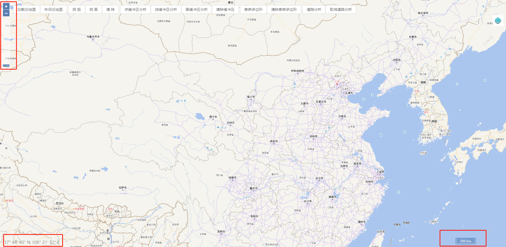
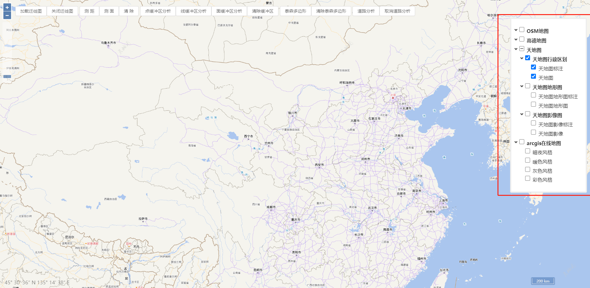
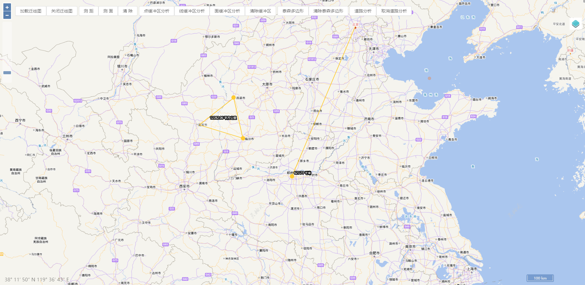
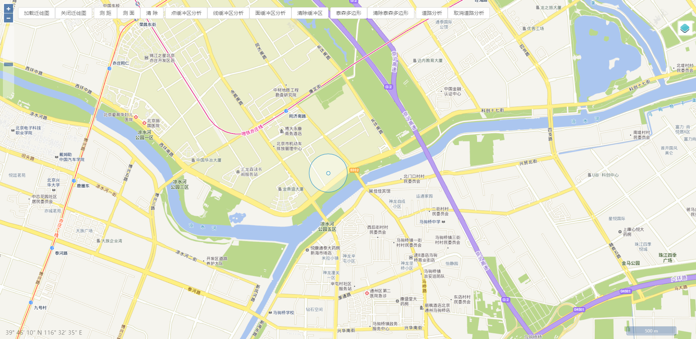
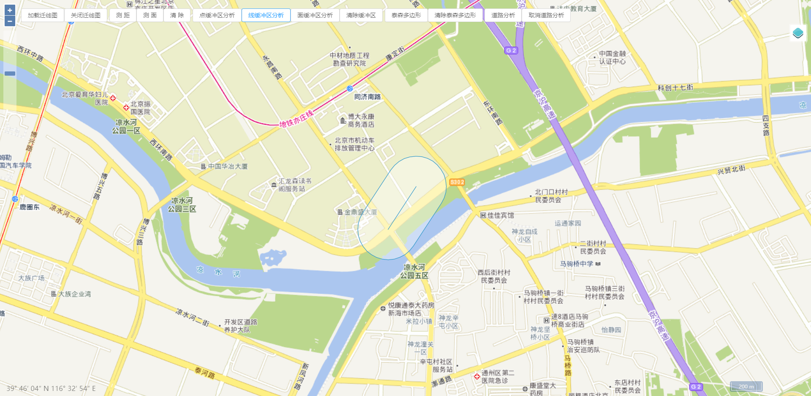
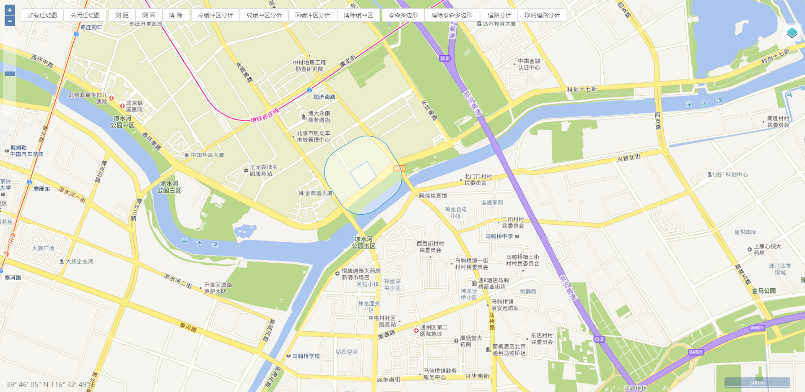
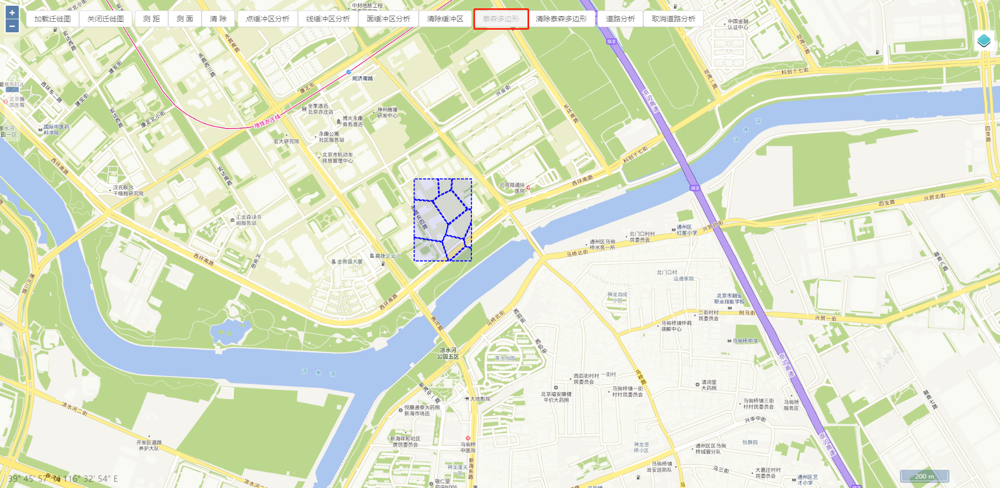
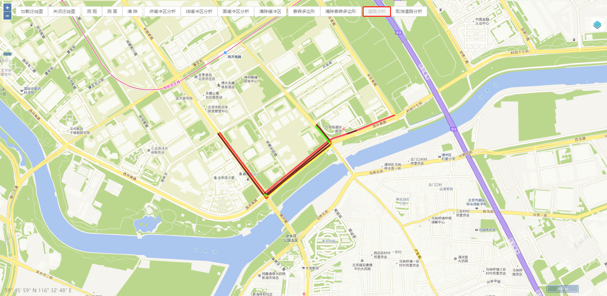

# bcadr_map_vue（GIS、openlayers、vue)

# 简介

​		[bcadr_map_vue](http://www.bcadr.cn)是美丽华夏大数据研究院基于开源框架vue和openlayers开发的一款二维在线GIS应用程序。在多源数据加载、二维空间分析以及多种可视化效果等功能的支撑下，用户可以进行开箱即用的进行二维地图操作。

​		在线预览访问地址：[bcadr_map_vue](http://gis_vue_2d.bcadr.cn/)

# 一、开始

### 项目注册依赖

```
//cd到项目根目录
npm install
```

### 项目启动服务
```
npm run serve
```

### 项目打包
```
npm run build
```

### EsLint检测
```
npm run lint
```

# 二、功能模块

### 1.集成地图常用控件



### 2.加载多种地图源，图层控制功能



### 3.集成加载Echarts迁徙图


### 4.测量距离和测量面积



### 5.缓冲区分析（包括点、线、面）

点缓冲区分析



线缓冲区分析



面缓冲区分析



### 6.泰森多边形（区域内多个点经过空间算法形成泰森多边形）



### 7.道路分析（即实时显示当前交通路网拥堵情况，每3秒刷新一次）



### 五、证书

Copyright © 2020 - 2021 美丽华夏大数据研究院有限公司

Licensed under the Apache License, Version 2.0 (the "License"); you may not use this file except in compliance with the License. You may obtain a copy of the License at

> http://www.apache.org/licenses/LICENSE-2.0

Unless required by applicable law or agreed to in writing, software distributed under the License is distributed on an "AS IS" BASIS, WITHOUT WARRANTIES OR CONDITIONS OF ANY KIND, either express or implied. See the License for the specific language governing permissions and limitations under the License.

A copy of the license is available in the repository's [LICENSE](https://github.com/bcadr/bcadr_map_vue/blob/main/LICENSE) file.